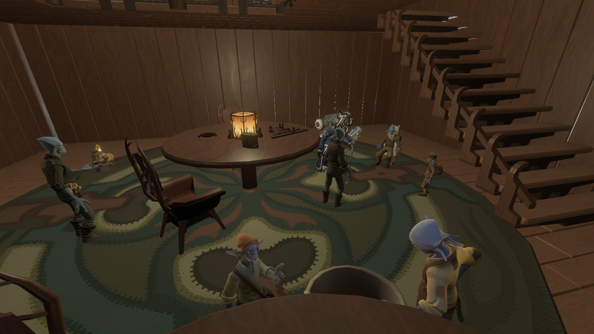

# 

# OW Mod Jam Hub
A hub dedicated to celebrating the Outer Wilds modding community. Compatible with the base-game system, the jam 3 system, and the jam 5 system.

# Features
- A party house on the north pole with many modders from the community.
- A series of exhibits around the equator showing off some of the mods made by the community.
- A computer and orrery on the south pole that helps track mods in the two jam systems.
